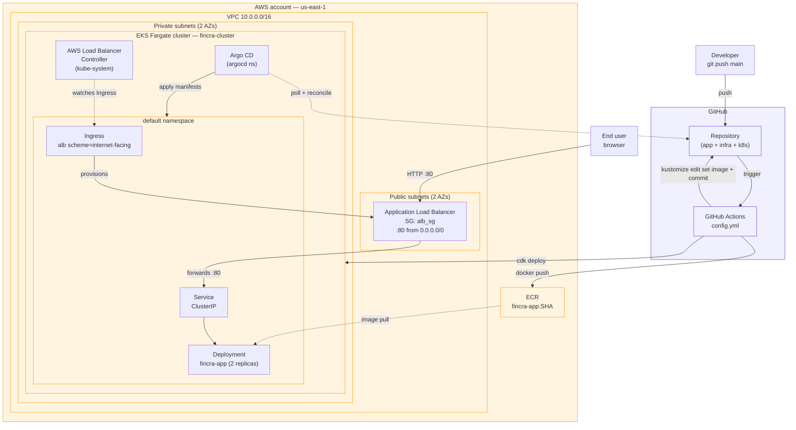

# Architecture

## System diagram



## Walk-through

### 1. Commit lands on `main`

GitHub Actions runs four jobs:

1. **`lint-and-test`** — runs the Flask smoke test in-process (no container
   needed), synthesizes the CDK stacks, and renders the Kustomize overlay.
   Catches ~90% of breakage before we spend a minute on AWS.
2. **`build-and-push`** — authenticates to AWS via OIDC (no static keys),
   builds the Docker image from `app/Dockerfile`, pushes to ECR tagged with
   the short git SHA.
3. **`deploy-infra`** — `cdk bootstrap` (idempotent), then `cdk deploy --all`.
   On a green-field account the first run creates the VPC, SGs, EKS cluster,
   Fargate profiles, ALB Controller (via Helm from CDK), and Argo CD (also via
   Helm). On subsequent runs it's a diff — usually a no-op.
4. **`bump-image`** — `kustomize edit set image` to point the overlay at the
   new ECR tag, then commits and pushes back to `main`. This is the only CI
   write to the cluster's declared state.

### 2. Argo CD takes over

Argo CD polls the repo. When it sees the commit from step 4, it diffs the
rendered manifests against live state and applies the delta. The Deployment's
image changes, a rolling update starts, new pods come up, the Service endpoints
update, the ALB target group sees new healthy targets, old pods drain.

### 3. How a request flows

```
User → DNS → ALB (public, alb_sg allows :80) →
  ALB target group (pod IPs, registered by the ALB Controller) →
  Fargate pod on a private subnet (cluster_sg allows ALB traffic) →
  Flask :80 → "Hello, from Fincra!"
```

## Security group mapping to the brief

| Brief requirement | Implemented as |
|---|---|
| Allow all egress | `allow_all_outbound=True` on both SGs |
| Deny all ingress, except… | SG default-deny; rules below added explicitly |
| TCP 80, 443 from internet | `alb_sg` ingress from `0.0.0.0/0` |
| ICMP from internet | `alb_sg` + `cluster_sg` ingress from `0.0.0.0/0` on `icmp_ping` |
| All TCP/UDP internal to VPC | `cluster_sg` self-referencing ingress on all TCP and all UDP |

The self-referencing rule is stricter than a blanket CIDR allow but meets the
intent — "internal workloads can talk to each other on any port" — without
opening ephemeral ports to anything that happens to land in the VPC.

## Failure modes and what fixes them

| Symptom | Likely cause | Fix |
|---|---|---|
| `Ingress ADDRESS` stuck at `<pending>` | ALB Controller IRSA misconfigured | Check the SA's role has the inline policy; `kubectl logs -n kube-system deploy/aws-load-balancer-controller` |
| Argo CD `OutOfSync` forever | `repoURL` in the Application points at the wrong repo or unauthenticated private repo | Fix the URL; for private repos add a repo credential secret |
| Pods `Pending` with "no nodes match Fargate selectors" | Namespace isn't covered by any Fargate profile | Add a profile for that namespace in `EksStack` |
| `cdk deploy` rolls back citing "cannot delete SG still in use" | The Fargate profiles still reference it | Expected on cluster destroy; retry, or delete the cluster first |
